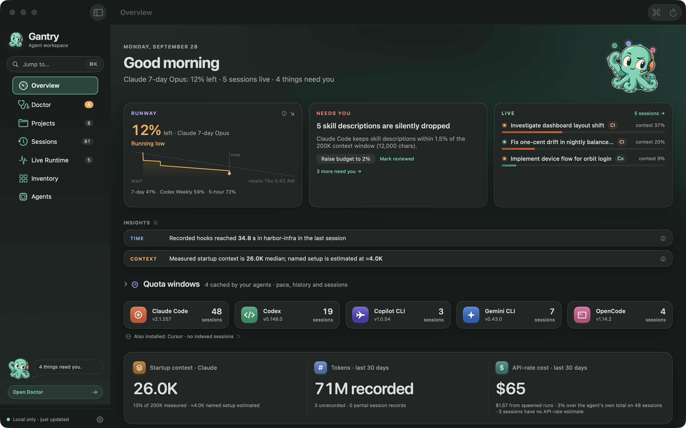
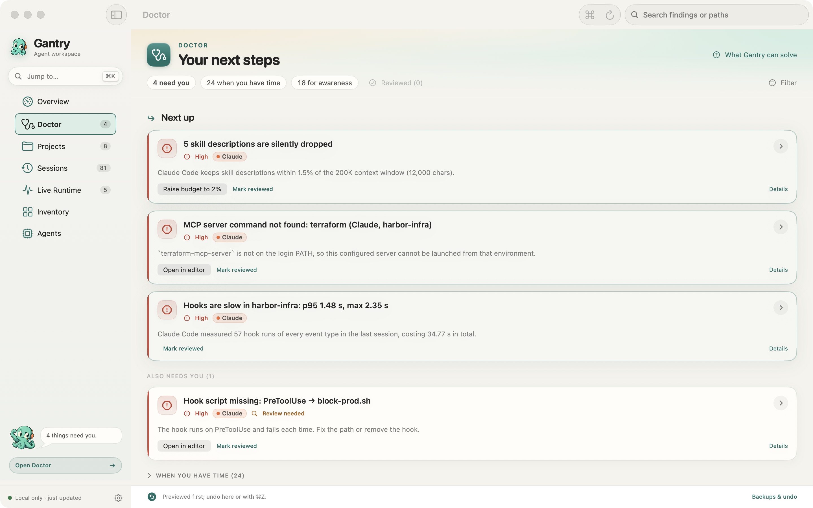

  
  <h1>Gantry</h1>
  
<strong>看清配额，理解上下文，检查你的 AI 编程配置。</strong>

  
面向 <strong>Claude Code、Codex 及其他 AI 编程工具</strong>的原生 macOS 仪表盘。

  
<a href="https://github.com/devin-lai/Gantry/releases/download/v1.0.0-build79-preview/Gantry-1.0.0-build79-public-preview.dmg"><strong>下载 macOS 公开预览版</strong></a> · <a href="docs/getting-started.md">安装说明（英文）</a> · <a href="https://github.com/devin-lai/Gantry/releases/tag/v1.0.0-build79-preview">发布说明与校验值</a>

  
<strong>macOS 13+ · Apple 芯片与 Intel · 个人非商业用途免费</strong>

  
此预览版采用 ad-hoc 签名，<strong>未经 Apple 公证</strong>。应用源代码保持私有。

  
<a href="README.md">English</a> · <strong>简体中文</strong>

*截图使用合成演示数据。数字仅用于展示界面；界面和可用测量项会随版本及工具而变化。此文档提供中文介绍，不代表应用界面已支持中文。*

## Gantry 能帮你看清什么

会话日志、指令文件、技能、钩子和 MCP 服务器分散在不同位置。Gantry 将本地证据汇集到一个工作区，帮助你判断哪些配置值得关注，以及是否需要修改。

| 你关心的问题 | Gantry 提供的信息 |
| --- | --- |
| **配额快用完了吗？** | Claude Code 和 Codex 的本地缓存配额窗口、重置时间、数据新鲜度与使用节奏，以及菜单栏视图。 |
| **第一条提示词之前加载了什么？** | 指令、规则、技能、代理定义和 MCP 工具描述的清单与 token 估算；工具有记录时，也能查看启动上下文测量值。 |
| **MCP 或钩子为什么慢？** | MCP 初始化和工具列表获取耗时，以及编程工具记录的 API、工具和钩子耗时。 |
| **配置问题该怎么处理？** | Doctor 按优先级展示发现、证据和下一步；支持的文件修改可以先预览，再应用，并保留本地备份以便撤销。 |

支持的工具包括 **Claude Code、Codex、Cursor、Gemini CLI、OpenCode 和 Copilot CLI**。只用其中一种也可以，无需迁移工作流或注册 Gantry 账户。

**各工具覆盖范围不同。** 配额覆盖适用于 Claude Code 和 Codex；此版本对 Cursor 的覆盖是配置清单，不包含聊天用量或配额。其他工具也不宣称具备配额覆盖。[完整兼容性与限制（英文）](docs/compatibility.md)。

## 从一个问题开始

1. **查看配额：** 打开 **Overview**，同时检查剩余量、重置时间和数据新鲜度。
2. **理解上下文：** 打开 **Inventory**，查看项目和工具配置中的指令、技能及 MCP 条目。
3. **检查 MCP：** 先看已有耗时证据；只有在你希望运行已配置服务器时，再选择主动基准测试。
4. **审查配置问题：** 打开 **Doctor**，阅读证据，并在应用支持的文件修改前检查预览。

[四个具体工作流（英文）→](docs/workflows.md)

支持的文件修改会创建本地备份，可在应用内或用 **⌘Z** 撤销。删除文件使用废纸篓；停止进程的恢复方式不同，不能一概视为可以用 ⌘Z 撤销的文件修改。

  
<strong>查看 Doctor 界面</strong>

*合成演示数据；实际发现取决于配置与版本。*

**Projects** 和 **Sessions** 展示记录中的用量及按 API 价格计算的费用估算；**Live Runtime** 展示代理与 MCP 进程的 CPU 和内存。**⌘K** 快速跳转，**⌘R** 刷新工作区。

## 本地数据与隐私

Gantry 的索引和修改备份保存在你的 Mac 上。它**不要求 Gantry 账户，不含分析遥测**，也不会将会话历史上传到 Gantry 服务。

MCP 基准测试属于主动操作：它可能启动已配置的服务器，或访问你选择的 HTTP 端点。服务器可以使用自身配置中的凭据并发起网络请求。欢迎界面或 Settings 中可选择是否启用自动 stdio 基准测试。[隐私说明（英文）](PRIVACY.md) · [build 79 下载文件审计（英文）](docs/build79-audit.md)。

## 下载与首次启动

1. 从[官方发布页](https://github.com/devin-lai/Gantry/releases/tag/v1.0.0-build79-preview)下载 DMG 和 `SHA256SUMS.txt`，核对 SHA-256。
2. 打开 DMG，将 **Gantry** 拖入 **Applications**。
3. 打开应用，阅读欢迎界面，并选择 MCP 基准测试偏好。

要求 **macOS 13 Ventura 或更新版本**，支持 Apple 芯片和 Intel。build 79 公开预览版采用 ad-hoc 签名，**未经 Apple 公证**。如果 macOS 阻止首次启动，请在核对下载文件并决定信任它后，按[安装说明（英文）](docs/getting-started.md)操作。校验值用于确认文件内容，不代表 Apple 认可或发布者身份认证。

此版本没有内置更新源。可在仓库中选择 **Watch → Custom → Releases**，接收新版本通知。

## 正确理解数据

- 配额来自工具保存在本地的缓存，可能过时，不能替代服务商的用量页面。
- 费用是按 API 价格计算的估算值，不是订阅账单。上下文组成可能是估算，部分用量也可能无法归因。
- 数据缺失或不完整会限制显示内容。Gantry 不保证降低费用、加快模型响应或提高回答质量。

[常见问题（英文）](docs/faq.md) · [兼容性（英文）](docs/compatibility.md)

## 帮助更多用户发现 Gantry

如果 Gantry 对你有用，欢迎 **Star 仓库**，并将[官方仓库链接](https://github.com/devin-lai/Gantry)分享给使用相关编程工具的人。请分享官方链接，不要重新托管应用文件。[简短分享文案](docs/share.md)。

[报告问题](https://github.com/devin-lai/Gantry/issues/new?template=bug_report.yml)、[提出工作流建议](https://github.com/devin-lai/Gantry/issues/new?template=feature_request.yml)或改进文档与翻译都很有帮助。公开提交前，请移除密钥、账户标识、私有路径和机密提示词，不要附上完整会话记录。敏感安全问题请按 [SECURITY.md](SECURITY.md) 私下报告。

## 许可

**仅个人非商业用途免费。** Gantry 是专有软件；此公开仓库提供文档、反馈入口和二进制发布，应用源代码保持私有。商业、雇主或客户用途需要另行获得许可。完整条款以 [LICENSE](LICENSE) 为准。

Gantry 是独立应用，与所支持编程工具的厂商没有隶属关系。
